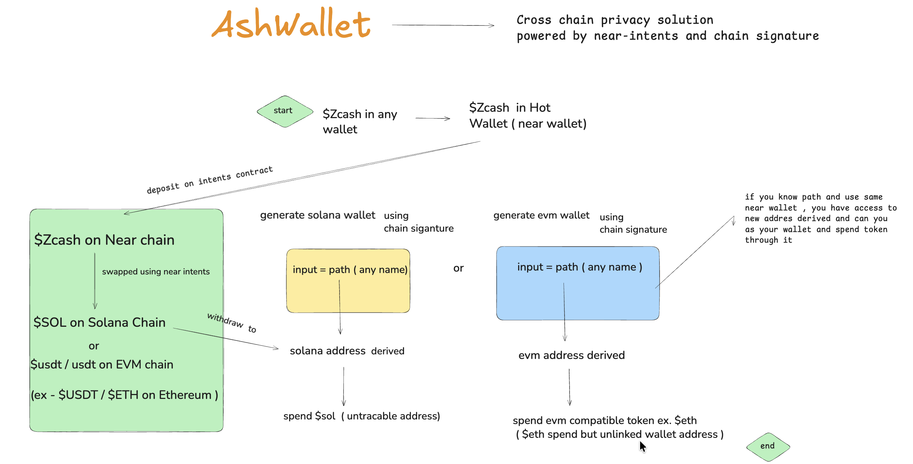

# AshWallet

Generate anonymous wallets using chain signatures. Derive addresses on Solana, NEAR, and EVM chains from a single NEAR account. Spend from anonymous wallet , use any token , swap ZCash to any supported token on any chain via NEAR intents.



## 🎯 The Problem It Solves

### **Privacy & Anonymity Challenges in DeFi**

Traditional blockchain wallets expose your entire transaction history to anyone who knows your address. This creates several critical problems:

#### **1. Complete Transaction Transparency**
- **Problem**: Every transaction on public blockchains is permanently visible and traceable
- **Solution**: Generate unlimited anonymous addresses that cannot be linked to your identity or each other
- **Use Case**: Protect your financial privacy when trading, swapping, or interacting with DeFi protocols

#### **2. Cross-Chain Identity Linking**
- **Problem**: Using the same wallet across multiple chains allows anyone to link your activity across Solana, NEAR, Ethereum, etc.
- **Solution**: Derive unique, unlinkable addresses on each chain from a single NEAR account using chain signatures
- **Use Case**: Maintain separate identities across chains while managing everything from one account

#### **3. KYC Requirements & Identity Exposure**
- **Problem**: Many DeFi platforms require KYC, forcing you to reveal your identity
- **Solution**: No KYC required - generate addresses anonymously without any identity verification
- **Use Case**: Access DeFi services without compromising your privacy or personal information

#### **4. Complex Multi-Chain Wallet Management**
- **Problem**: Managing separate wallets, private keys, and seed phrases for each chain is complex and risky
- **Solution**: One NEAR account controls infinite addresses across all supported chains via chain signatures
- **Use Case**: Simplify your multi-chain operations without managing multiple wallets or keys

#### **5. Traceable Cross-Chain Swaps**
- **Problem**: Traditional bridges and swaps leave a clear trail connecting your source and destination addresses
- **Solution**: Swap ZCash to any token on any chain via NEAR intents with enhanced privacy
- **Use Case**: Move assets across chains without revealing the connection between addresses

#### **6. Limited Address Generation**
- **Problem**: Most wallets generate a fixed set of addresses from a single seed phrase
- **Solution**: Generate unlimited unique addresses by simply choosing different wallet names (paths)
- **Use Case**: Create separate addresses for different purposes (trading, savings, DeFi) without managing multiple wallets

### **Real-World Use Cases**

- **Private Trading**: Execute trades without exposing your trading patterns or portfolio size
- **Anonymous DeFi**: Interact with lending, staking, and yield farming protocols privately
- **Cross-Chain Privacy**: Move assets between chains without linking your identities
- **Financial Privacy**: Protect your wealth and transaction history from surveillance
- **Identity Separation**: Maintain different financial identities for different purposes
- **Untraceable Payments**: Send and receive payments without revealing your main wallet

### **How It Makes Existing Tasks Easier & Safer**

✅ **Simplified Multi-Chain Management**: One account, infinite addresses, no key management complexity

✅ **Enhanced Privacy**: Every transaction uses a unique, unlinkable address

✅ **No KYC Hassles**: Access DeFi services without identity verification

✅ **Untraceable Swaps**: Cross-chain swaps that don't reveal address connections

✅ **Zero Trust Required**: No need to trust third-party privacy services - privacy is built into the protocol

✅ **Future-Proof**: Works across Solana, NEAR, EVM chains, and more as chain signatures expand

## 🔒 How Privacy Wallets Work

Simple flow using chain signatures and NEAR intents:

1. **Connect NEAR Wallet** - Connect your NEAR wallet to get started
2. **Enter Wallet Name** - Provide a unique name (path) for your wallet
3. **Derive Address** - Chain signature derives a unique address on your chosen chain (Solana, NEAR, or EVM)
4. **Swap ZEC to SOL** - Swap your ZEC on NEAR to SOL on Solana via NEAR intents ( internally)
5. **Use Anonymously** - Use the derived address for private DeFi interactions

## 🚀 Features

- **Chain Signatures**: Derive addresses on multiple chains from single NEAR account
- **Multi-Chain Support**: Solana, NEAR, and EVM chains (Ethereum, Polygon, etc.)
- **NEAR Intents Integration**: Seamless cross-chain swaps via NEAR intents
- **Privacy by Design**: Each wallet name (path) generates a unique address
- **No KYC Required**: Fully anonymous, no identity verification needed
- **Unlimited Addresses**: Generate as many addresses as you need with different names

## 🛠 Getting Started

First, run the development server:

```bash
npm run dev
# or
yarn dev
# or
pnpm dev
# or
bun dev
```

Open [http://localhost:3000](http://localhost:3000) with your browser to see the result.

### Key Pages

- `/` - Landing page explaining Privacy Wallets
- `/wallet` - Privacy Wallet Generator (main interface - enter name, derive address, swap)

## 🔗 Supported Chains

- **Solana**: Derive Solana addresses using chain signatures
- **NEAR**: Native NEAR addresses from your connected wallet
- **EVM Chains**: Ethereum, Polygon, and other EVM-compatible chains

## 💡 How It Works

1. Connect your NEAR wallet
2. Enter a unique wallet name (this becomes the derivation path)
3. System derives a unique address on your chosen chain using chain signatures
4. Swap ZEC on NEAR to SOL (or other tokens) on destination chain via NEAR intents
5. Use the derived address for anonymous DeFi interactions

This project uses [`next/font`](https://nextjs.org/docs/app/building-your-application/optimizing/fonts) to automatically optimize and load [Geist](https://vercel.com/font), a new font family for Vercel.

## Learn More

To learn more about Next.js, take a look at the following resources:

- [Next.js Documentation](https://nextjs.org/docs) - learn about Next.js features and API.
- [Learn Next.js](https://nextjs.org/learn) - an interactive Next.js tutorial.

You can check out [the Next.js GitHub repository](https://github.com/vercel/next.js) - your feedback and contributions are welcome!

## Deploy on Vercel

The easiest way to deploy your Next.js app is to use the [Vercel Platform](https://vercel.com/new?utm_medium=default-template&filter=next.js&utm_source=create-next-app&utm_campaign=create-next-app-readme) from the creators of Next.js.

Check out our [Next.js deployment documentation](https://nextjs.org/docs/app/building-your-application/deploying) for more details.
